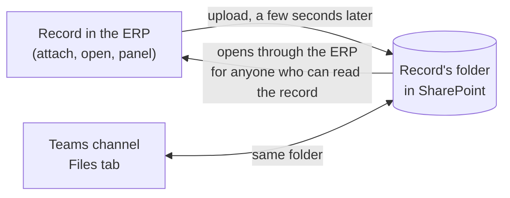

# SharePoint File Storage — User Guide

A guide for the people who use and set up SharePoint document storage. For how it works
inside, see [sharepoint-files.md](sharepoint-files.md); for errors, [troubleshooting.md](troubleshooting.md#sharepoint-document-storage).

## What it does

Attachments on chosen record types are kept in SharePoint, in the Microsoft Teams channel where the team already works, instead of on the ERP server. Each record gets its own folder, and the files still open from the record as before.

- **One folder per record.** The first attachment on a record creates its folder, named after the record (for example `PROJ-0001`).
- **Files move automatically.** A file attached in the ERP is uploaded to that folder a few seconds later, and the copy on the server is removed to save disk space.
- **Teams and the ERP stay in step.** Files people drop into the folder from Teams show on the record in a **Files in Microsoft 365** panel.
- **Access follows the ERP.** Anyone who can read the record can open its files through the ERP, with or without a SharePoint licence.
- **Nothing is deleted from SharePoint** unless an administrator turns that on, and even then files go to the site's recycle bin.



The folder is the single place the files live; the ERP record and the Teams channel are two windows onto it.

## Everyday use

Attach files exactly as you always have; storage in SharePoint happens on its own.

**Attaching a file**

1. Open the record, click **Attach** (paperclip) in the sidebar and upload the file.
2. Within a few seconds the file is copied into the record's folder in SharePoint. The sidebar link updates by itself; no reload is needed.
3. Click the attachment to open it. PDFs, images and text open in a new tab; other files download.

**The Files in Microsoft 365 panel**

On records of a mapped type, a **Files in Microsoft 365** panel sits near the top of the form. It lists everything in the record's SharePoint folder, including files and subfolders added from Teams.

- Click a file name to open it, or the download arrow to save it.
- Click a folder to go into it; use the path at the top to go back.
- **Refresh** reloads the list after someone adds a file in Teams.
- **Open in SharePoint** opens the folder itself, for anyone with access to the Teams channel.
- A file marked *attachment* was attached in the ERP; the others were added in Teams or SharePoint.
- If the record has no folder yet, the panel says so and offers **Create folder now**.
  - On record types set to *On demand*, files stay on the ERP server until someone clicks **Create folder now**. The record's existing attachments then move, and new ones follow.

**Working from Teams**

Open the channel's **Files** (or **Shared**) tab and find the folder named after the record. Anything saved there appears in the record's panel. Renaming or moving the folder inside the library does not break the link.

**Good to know**

- Images or files in a field on the form (a logo, a signature, an *Attach* field) stay on the ERP server so print formats keep working. Only sidebar attachments move.
- Deleting an attachment in the ERP removes it from the record, but the copy in SharePoint stays unless your administrator has chosen otherwise.

## Admin setup: the Microsoft side (once)

The ERP connects as its own app with access to only the SharePoint sites you grant it; no one's personal sign-in is used. A Global Administrator does these steps once per Microsoft 365 tenant.

**1. Register the app** in the Microsoft Entra admin center: *Identity → Applications → App registrations → New registration*.

- Name it after the ERP site, e.g. `ERP – production`. Use one registration per ERP site so each can be revoked alone.
- Supported account types: **this organizational directory only**. Leave the redirect URI blank.
- From **Overview**, note the **Application (client) ID** and the **Directory (tenant) ID**.

**2. Create a client secret**: *Certificates & secrets → New client secret*.

- Copy the **Value** with the copy icon before leaving the page. Once you leave, only a masked prefix is shown. The **Secret ID** next to it does not work.
- Paste it straight into the ERP; never send it by email or chat.
- Note the expiry date. Uploads stop the day the secret expires, so set a reminder to replace it.

**3. Add the permission**: *API permissions → Add a permission → Microsoft Graph → Application permissions → `Sites.Selected` → Add*, then **Grant admin consent**.

- It must be under **Microsoft Graph**, as an **Application** permission. The SharePoint API lists a permission with the same name that does not work for this.
- `Sites.Selected` on its own reaches no site. Step 4 grants the sites.

**4. Grant the app each SharePoint site** it should use, with the role `write`. The ERP generates the script: open the mapping (next section) and click **Site Grant Script**, or copy the one for every mapped site from the **Site Grant Script** section of SharePoint Settings. Run it in Microsoft Graph PowerShell as a SharePoint or Global Administrator.

Without PowerShell, use Graph Explorer: consent to `Sites.FullControl.All` for your own session, click **Reload**, then `GET /sites/<tenant>.sharepoint.com:/sites/<SiteName>` to get the site id, and `POST /sites/<site id>/permissions` with this request body:

```json
{
  "roles": ["write"],
  "grantedToIdentities": [
    { "application": { "id": "<Application (client) ID>", "displayName": "ERP" } }
  ]
}
```

A `201 Created` reply means the grant is in place. Afterwards you can remove the `Sites.FullControl.All` consent from Graph Explorer; the ERP app never needs it.

## Admin setup: the ERP side

Three places hold the configuration: **Microsoft Settings** for the connection, SharePoint Settings for how storage behaves, and one **SharePoint Mapping** per record type for where its files go.

**Microsoft Settings and SharePoint Settings**

1. Fill in **Tenant ID**, **Client ID** and **Client Secret Value** from the Microsoft setup. Tenant ID must be the directory ID, not `common`.
2. Tick **Enabled** and **SharePoint document storage**, then **Save**.
3. Open **SharePoint Settings** (sidebar *SharePoint Settings*, or the link under the tickbox) and choose the options:

| Option | Off (default) | On |
| --- | --- | --- |
| Keep a local copy after upload | The server copy is deleted once the file is in SharePoint, freeing disk space | Both copies are kept; useful while trialling. If the SharePoint copy disappears, the local one is served |
| Also copy linked files into SharePoint | Attachments that are only a web link stay links | The linked file is downloaded once and archived in the record's folder; the link is kept |
| Remove from SharePoint when the attachment is deleted | SharePoint keeps the file | The file goes to the site's recycle bin, where it can be restored |

These are the defaults for every record type. Two of them can be set differently for one record type, under **Options** on its SharePoint Mapping (next section): **Keep a local copy after upload** and **Remove from SharePoint when the attachment is deleted**. Each offers **Default** (follow SharePoint Settings; the mapping shows what that currently is), **On** or **Off**. Typical uses: keep local copies only for the record type being trialled, or set removal to **Off** for a record type whose documents must be retained even when deleted in the ERP. **Also copy linked files** and **If this app is uninstalled** are site-wide only.

**SharePoint Mapping** (sidebar *SharePoint → Mappings*, then **Add**)

Each mapping is its own record, named after its record type, so a type can only be mapped once.

| Field | What to enter |
| --- | --- |
| Enabled | Untick to pause storage for this type without losing the settings |
| DocType | The record type whose attachments go to SharePoint, e.g. Project |
| SharePoint Site URL | In Teams, open the channel's Files tab → *Open in SharePoint* and paste the address. Everything after `/sites/<name>` is ignored |
| Document Library | `Documents` for Teams. SharePoint shows it as *Shared Documents* |
| Group record folders in a base folder | On: record folders go inside the Base Folder. Off: they go straight into the library |
| Base Folder | The folder that holds the record folders, created if missing. Nested paths like `Projects/2026` work |
| Folder Name Pattern | How each record's folder is named. `{name}` by default; any field works, e.g. `{name} - {customer}`. Characters SharePoint refuses are replaced |

**Folder Creation** decides how much moves to SharePoint:

| Setting | What happens |
| --- | --- |
| Automatic (default) | Every record gets a folder on its first attachment, and all its attachments move to SharePoint |
| On demand | Nothing moves until someone creates a record's folder, with **Create folder now** on the record or a row added to the mapping's **Folders** table. From then on that record's attachments move; other records stay on the server |

Use *On demand* when only some records of a type belong in Teams, for example the ones the team is actively working on.

After saving, use the buttons at the top of the mapping: **Test**, **Site Grant Script** and **Move Existing Attachments** (next section).

**Standard, private and shared Teams channels**

- **Standard channel:** its files live in a folder of the team's site. Use the team's site URL, keep **Group record folders in a base folder** on, and set **Base Folder** to the channel name.
- **Private or shared channel:** it has a SharePoint site of its own, usually `/sites/<Team>-<Channel>`, which exists once someone has opened the channel's Files tab. Use that site's URL and untick **Group record folders in a base folder**, so record folders appear directly in the channel. Grant the app this site; a grant on the team's site does not cover it.
- Files opened through the ERP follow ERP permissions, not channel membership. For a private channel, make sure only the right roles can read that record type in the ERP.

## Day-to-day administration

**Test a mapping.** Click **Test** on the mapping after any change. It signs in as the app, finds the site and library, and creates and removes a `frappe-connection-test` folder, so a missing or read-only grant shows up before the first real upload. A green *OK* means files will flow. *Troubleshoot → Test SharePoint Connection* tests every mapping at once.

**Move older attachments.** Files attached before a type was mapped stay on the server until you click **Move Existing Attachments** on its mapping (or SharePoint Settings → Actions, for every mapping). It queues up to 500 files per click; run it again if it says there are more. Each file keeps opening from its record throughout.

**Add or link a folder by hand.** Open *SharePoint → Mappings* and the record type's mapping. Its **Folders** table has one row per record with a folder; the system adds rows as records get theirs. Click **Add Row**, pick the record and, optionally, fill in **Existing Folder**, then **Save**:

- leave **Existing Folder** empty, and the folder is created where the mapping says; or
- paste the address of a folder that already exists, from the browser or *Copy link* in SharePoint or Teams, or its path in the library such as `Projects/PROJ-0001`, to link it.

The record's attachments still on the server then move into the folder. Each record can have one folder. Deleting a row and saving removes only the link: the folder and its files stay in SharePoint, and files already stored there keep opening.

**Check a file's status.** Open an attachment's File record and expand **Microsoft 365**:

| SharePoint Status | Meaning |
| --- | --- |
| Pending | Waiting for the background job; normally clears within seconds |
| Stored | Moved to SharePoint; opens from there through the ERP |
| Archived | A web link whose target was copied into SharePoint; the link itself is unchanged |
| Failed | Still on the server and still opens; **Last SharePoint Error** says why. Retried hourly, up to 5 times |

To list problem files, open the File list filtered on *SharePoint Status = Failed*. SharePoint Settings shows counts by status, as does the line under the tickbox on Microsoft Settings.

**What happens when…**

| Event | Result |
| --- | --- |
| An attachment is deleted in the ERP | SharePoint keeps the file, unless *Remove from SharePoint when the attachment is deleted* is on for that record type, in SharePoint Settings or on its mapping (then it goes to the recycle bin) |
| A record is deleted | Its SharePoint folder and files stay; only the ERP's link to the folder is removed |
| A record is renamed | Its folder is renamed to match |
| The folder is renamed or moved in Teams | The link keeps working; the ERP tracks the folder by its id, not its path |
| The folder is deleted in Teams | The next attachment creates a new folder |
| The mapping's site or library is changed | New folders go to the new place; existing folders stay where they are |
| The client secret expires | Uploads fail and wait as *Failed*; files still open from the server. Add a new secret and they retry |

**Removing the app.** Choose ahead of time in *SharePoint Settings → If this app is uninstalled* what happens to files stored in SharePoint:

- **Bring files back to this server:** each file is downloaded back and its attachment works as before. The uninstall first checks there is enough free disk space, and stops without downloading anything if there is not.
- **Leave files in SharePoint:** nothing is downloaded; each attachment becomes a link to its SharePoint copy, which opens for people with access to the site.

If no choice is made, the uninstall stops and asks. Either way, SharePoint copies are never deleted, and the app then removes every field and setting it added.

**Background worker.** Moves run on the ERP's background *long* queue. If files stay *Pending*, check that a worker is running: *Microsoft Settings → Troubleshoot → Run Diagnostics* reports it.

## Troubleshooting

Run **Test** on the mapping first; it names the failing step. Then match what you see:

| What you see | Cause | Fix |
| --- | --- | --- |
| `AADSTS7000215: Invalid client secret` | The secret's masked prefix or its Secret ID was pasted | Create a new secret, copy its **Value** before leaving the page, paste it into Microsoft Settings |
| *The app signed in, but its token carries no SharePoint permission*, or a 401 `generalException` | `Sites.Selected` is missing, Delegated, under the SharePoint API instead of Microsoft Graph, or consent was just granted | Add Microsoft Graph → Application → `Sites.Selected`, grant admin consent, wait a few minutes, test again |
| 403 / `accessDenied` on the site | The app was never granted this site | Run the mapping's **Site Grant Script** (or the Graph Explorer steps) for that site |
| *Can read … but not write to it* | The site was granted `read` instead of `write` | Grant it again with `"roles": ["write"]` |
| 404 / `itemNotFound` on the site or library | Wrong site URL, library name, or a private channel's site not yet created | Copy the URL from the channel's *Open in SharePoint*; library `Documents`; open the channel's Files tab once |
| Graph Explorer doesn't list `Sites.FullControl.All` | The permissions list follows the request in the URL box, or the account can't grant admin consent | Put the `POST …/permissions` URL in first, or use profile menu → *Consent to permissions*; sign in as an admin |
| Graph Explorer: `Empty Payload. JSON content expected.` | The POST was sent without a body | Paste the JSON into the **Request body** tab under the URL bar |
| Files stay *Pending* | No background worker is running | *Run Diagnostics*; start the worker (on Frappe Cloud it always runs) |
| Files show *Failed* | See the File's **Last SharePoint Error** | Fix the cause above; failed files retry hourly up to 5 times, or click **Move Existing Attachments** |
| An attachment link opens *Forbidden* | The page was opened before the file moved, and the live update didn't reach it | Reload the record; the link then opens from SharePoint |
| Record folders appear inside an extra folder in a private channel | **Group record folders in a base folder** is on | Untick it on the mapping; drag existing folders up a level in Teams if wanted |
